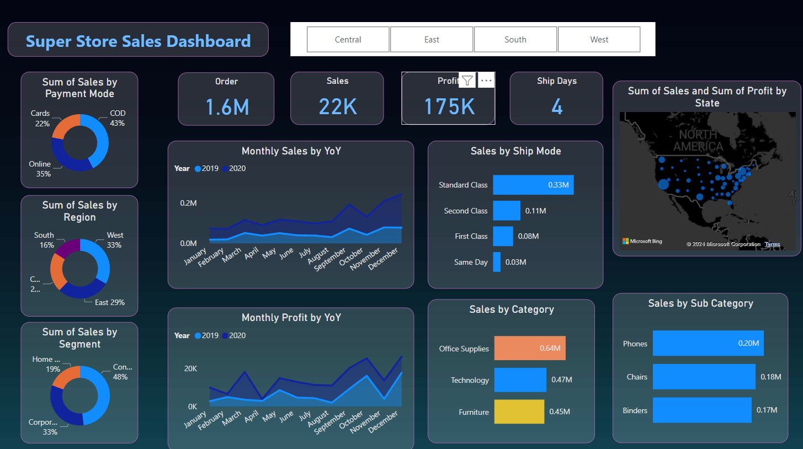

# Power_BI_SuperStore_Sales_Analysis
<b>Objective</b> :- 
To contribute to the success of a business by utilizing data analysis techniques, specifically focusing on time series analysis, to provide valuable insights.

<b>Description</b> :-
 
The objective can be broken down into the following detailed components:
1. Dashboard Creation: Identify the KPIs, design an intuitive and visually
appealing dashboard, add interactive visualizations and filtering capabilities to allow users to explore the data at various levels of granularity
3. Data Analysis: Provide valuable insights to business entities regarding the effectiveness of their sales strategies through visualization and charts.
4. Actionable Insights and Recommendations: End goal is to insights and actionable information that can drive strategic deci support the supermarket's goals for growth, efficiency, satisfaction.

<b>Example Dashboard</b> :-
 

  
<b>LEARNING</b> :-
 
Incorporated data analysis
techniques, specializing in time
series analysis, to deliver valuable insights, accurate sales forecasting, and interactive dashboard
creation, driving business success.

